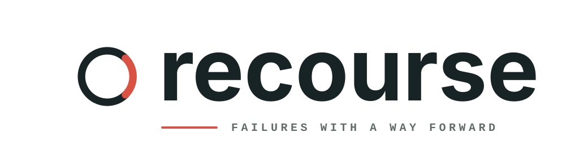

<p align="center">
  
</p>

<p align="center">
  <strong>Governed diagnostics for Rust applications and services.</strong>
</p>

<p align="center">
  <a href="https://github.com/zsumz/recourse/actions/workflows/ci.yml"></a>
</p>

<p align="center">
  Declare failures once. Keep codes, schemas, HTTP behavior, catalogs, and compatibility in sync.
</p>

<p align="center">
  <a href="#install">Install</a>
  <span> · </span>
  <a href="#example">Example</a>
  <span> · </span>
  <a href="#model">Model</a>
  <span> · </span>
  <a href="#features">Features</a>
  <span> · </span>
  <a href="#packages">Packages</a>
  <span> · </span>
  <a href="#cli">CLI</a>
</p>

<br />

## Install

```sh
cargo add recourse@=0.0.1-rc.2
```

Add the Axum adapter only at the application boundary:

```sh
cargo add recourse-axum@=0.0.1-rc.2
```

The core package has no async runtime or application-framework dependency.

## Example

A diagnostic declaration gives a failure a permanent code and type URI, typed
public evidence, HTTP policy, and human guidance. The Dispatch reference service
uses those declarations to produce responses like this:

```http
HTTP/1.1 404 Not Found
content-type: application/problem+json
x-request-id: jobs-test-request
```

```json
{
  "type": "https://dispatch.invalid/problems/DSP-1003",
  "title": "Job not found",
  "status": 404,
  "detail": "No job exists for the supplied identifier.",
  "instance": "https://api.dispatch.invalid/problem-occurrences/jobs-test-request",
  "code": "DSP-1003",
  "evidence": {
    "job_id": "job_01K00000000000000000000000"
  },
  "suggestions": [
    "Check the job identifier for transcription errors.",
    "Create a job before requesting its status."
  ]
}
```

Servers construct this contract strictly. Clients decode it tolerantly within
explicit size, depth, and member limits. Private source errors never become
public evidence.

## Model

Most error libraries help return an error body. Recourse governs the contract
around a failure and keeps that contract stable as a system changes.

```text
diagnostic declarations
        │
        ▼
 explicit catalog ───────► HTTP Problems, operations, and health findings
        │
        ▼
  catalog.json ──────────► catalog.lock ──────────► compatibility checks

 source errors ──────────► PrivateReport ─────────► application reporter
```

The public and private paths use different types. Catalog registration is
explicit, and retired identities remain tombstoned so old codes cannot be
silently reused.

## Features

- permanent diagnostic codes and type URIs
- typed, schema-governed public evidence
- strict RFC 9457 Problem construction and HTTP policy headers
- structurally separate public Problems and private reports
- durable operation diagnostics and health findings
- bounded tolerant decoding for old and future-compatible payloads
- deterministic catalog artifacts, append-only locks, and compatibility checks

## Packages

| Package | Role |
| --- | --- |
| [`recourse`](./crates/recourse/) | Framework-neutral protocol, catalog, encoding, and decoding |
| [`recourse-axum`](./crates/recourse-axum/) | Axum request context, lifecycle handling, and response translation |
| [`recourse-cli`](./crates/recourse-cli/) | Catalog checks, lock updates, explanations, and generated diagnostic pages |

The framework-neutral and Axum [Dispatch reference packages](./reference/)
exercise the public APIs across HTTP, background-work, CLI, catalog, and
compatibility boundaries.

## CLI

Installing `recourse-cli` provides the `cargo-recourse` binary and the
`cargo recourse` subcommand:

```sh
cargo install recourse-cli --version 0.0.1-rc.2 --locked
cargo recourse check --current diagnostics/catalog.json --lock diagnostics/catalog.lock
cargo recourse explain --current diagnostics/catalog.json DSP-1003
```

## Verification

Run the complete repository and package gate with:

```sh
scripts/check
```

The gate tests, lints, packages, extracts, installs, and runs every publishable
crate. Smoque drives a Ballast-shaped packaged consumer over real HTTP,
including the terminal SSE failure path. This edge check requires Node 22.18 or
newer. The gate does not publish or push.

## License

MIT. See [LICENSE](./LICENSE).
